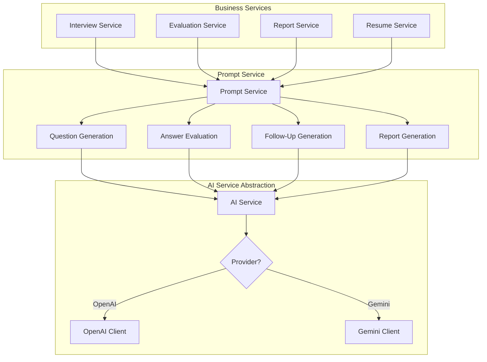
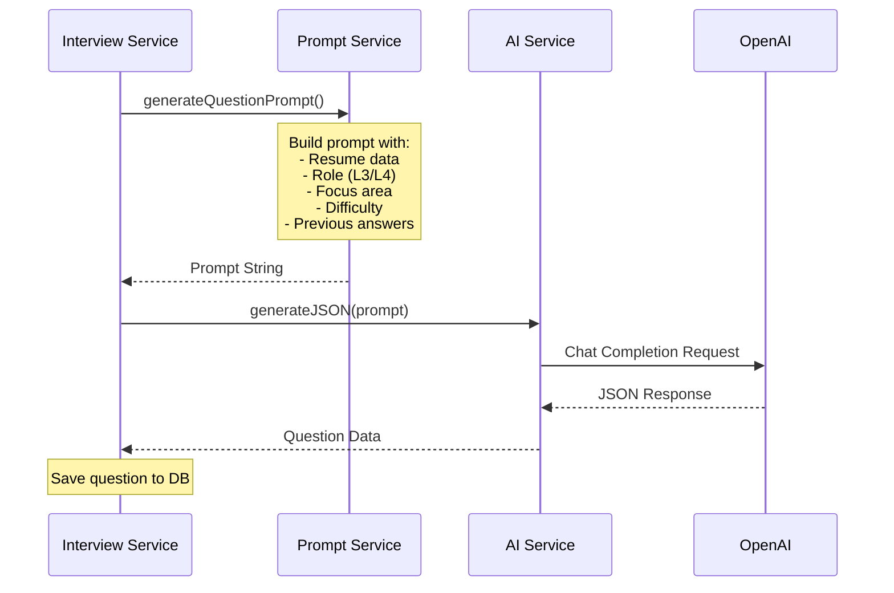
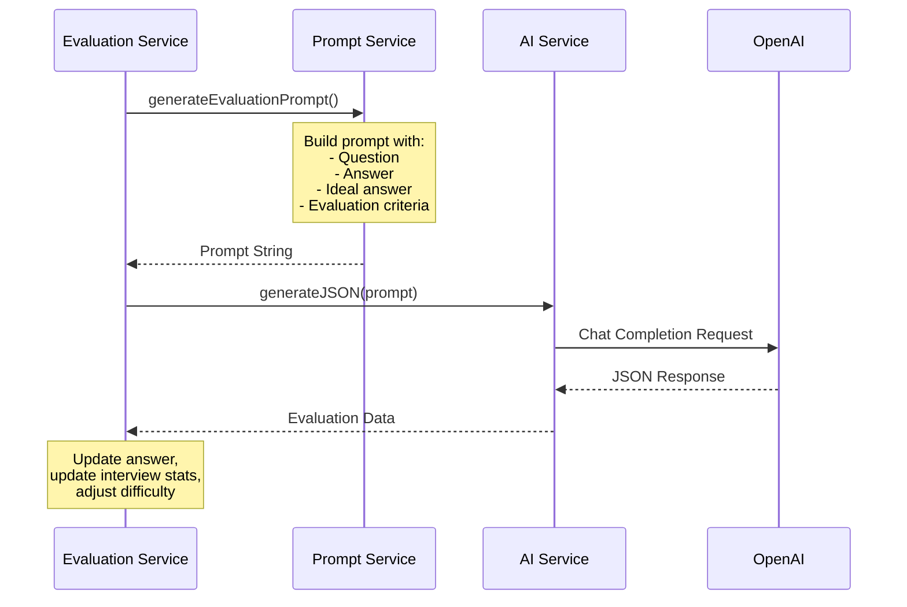

# AI Interaction Flow

## AI Service Architecture



## Question Generation Flow



## Answer Evaluation Flow



## Prompt Template Structure

### Question Generation Prompt
```
Generate a {difficulty} level {focusArea} interview question for a {role} Node.js backend engineer position.

Resume Context:
- Skills: [...]
- Experience: [...]
- Projects: [...]

Previous Answers Context:
- Q1: ... A1: ... Score: ...
- Q2: ... A2: ... Score: ...

Requirements:
- Appropriate for {role} level
- Focus on: {focusArea}
- Difficulty: {difficulty}
- Personalized based on resume

Response Format: JSON with questionText, questionType, category, difficulty, idealAnswer, evaluationCriteria
```

### Evaluation Prompt
```
Evaluate the following interview answer for a Node.js backend engineering position.

Question: {questionText}
Question Type: {questionType}
Category: {category}
Difficulty: {difficulty}

Candidate's Answer:
{answer}

Ideal Answer Reference:
{idealAnswer}

Evaluation Criteria:
{criteria}

Evaluate on:
1. Correctness (0-10)
2. Depth (0-10)
3. Clarity (0-10)
4. Real-world Relevance (0-10)

Provide: strengths, improvements, feedback, needsFollowUp

Response Format: JSON with scores, strengths, improvements, feedback
```
