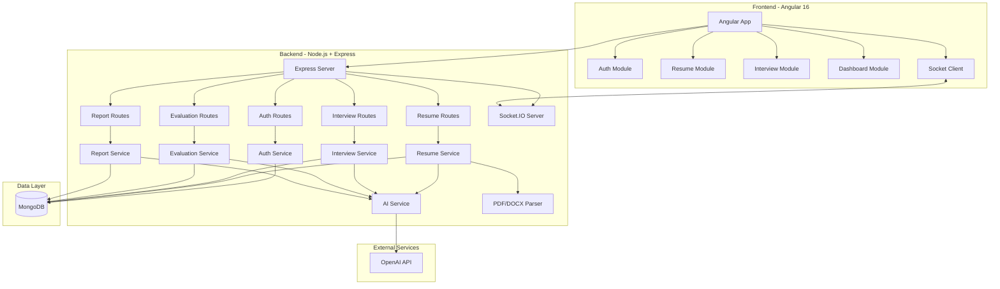
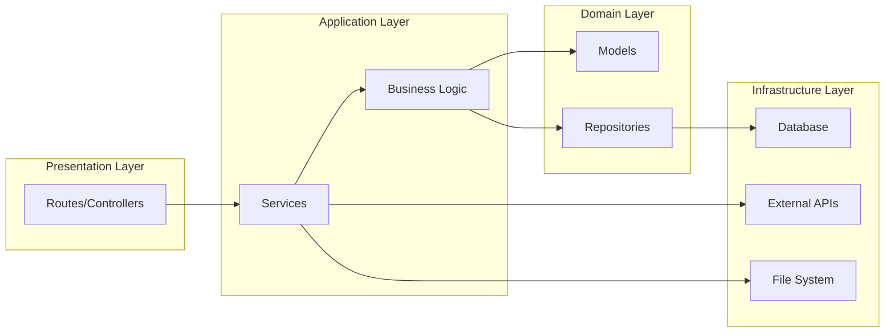
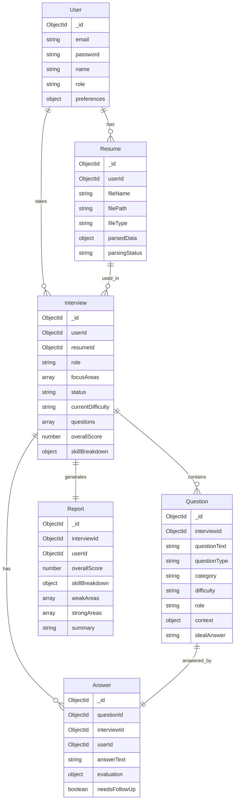

# System Architecture

## High-Level Architecture

```mermaid
graph TB
    subgraph "Frontend - Angular 16"
        A[Angular App] --> B[Auth Module]
        A --> C[Resume Module]
        A --> D[Interview Module]
        A --> E[Dashboard Module]
        A --> F[Socket Client]
    end
    
    subgraph "Backend - Node.js + Express"
        G[Express Server] --> H[Auth Routes]
        G --> I[Resume Routes]
        G --> J[Interview Routes]
        G --> K[Evaluation Routes]
        G --> L[Report Routes]
        G --> M[Socket.IO Server]
        
        H --> N[Auth Service]
        I --> O[Resume Service]
        J --> P[Interview Service]
        K --> Q[Evaluation Service]
        L --> R[Report Service]
        
        O --> S[AI Service]
        P --> S
        Q --> S
        R --> S
        
        O --> T[PDF/DOCX Parser]
    end
    
    subgraph "Data Layer"
        U[(MongoDB)]
        N --> U
        O --> U
        P --> U
        Q --> U
        R --> U
    end
    
    subgraph "External Services"
        V[OpenAI API]
        S --> V
    end
    
    F <--> M
    A --> G
```

## Clean Architecture Layers

```mermaid
graph LR
    subgraph "Presentation Layer"
        A[Routes/Controllers]
    end
    
    subgraph "Application Layer"
        B[Services]
        C[Business Logic]
    end
    
    subgraph "Domain Layer"
        D[Models]
        E[Repositories]
    end
    
    subgraph "Infrastructure Layer"
        F[Database]
        G[External APIs]
        H[File System]
    end
    
    A --> B
    B --> C
    C --> D
    C --> E
    E --> F
    B --> G
    B --> H
```

## Database Schema

```mermaid
erDiagram
    User ||--o{ Resume : has
    User ||--o{ Interview : takes
    Resume ||--o{ Interview : used_in
    Interview ||--o{ Question : contains
    Interview ||--o{ Answer : has
    Question ||--|| Answer : answered_by
    Interview ||--|| Report : generates
    
    User {
        ObjectId _id
        string email
        string password
        string name
        string role
        object preferences
    }
    
    Resume {
        ObjectId _id
        ObjectId userId
        string fileName
        string filePath
        string fileType
        object parsedData
        string parsingStatus
    }
    
    Interview {
        ObjectId _id
        ObjectId userId
        ObjectId resumeId
        string role
        array focusAreas
        string status
        string currentDifficulty
        array questions
        number overallScore
        object skillBreakdown
    }
    
    Question {
        ObjectId _id
        ObjectId interviewId
        string questionText
        string questionType
        string category
        string difficulty
        string role
        object context
        string idealAnswer
    }
    
    Answer {
        ObjectId _id
        ObjectId questionId
        ObjectId interviewId
        ObjectId userId
        string answerText
        object evaluation
        boolean needsFollowUp
    }
    
    Report {
        ObjectId _id
        ObjectId interviewId
        ObjectId userId
        number overallScore
        object skillBreakdown
        array weakAreas
        array strongAreas
        string summary
    }
```
