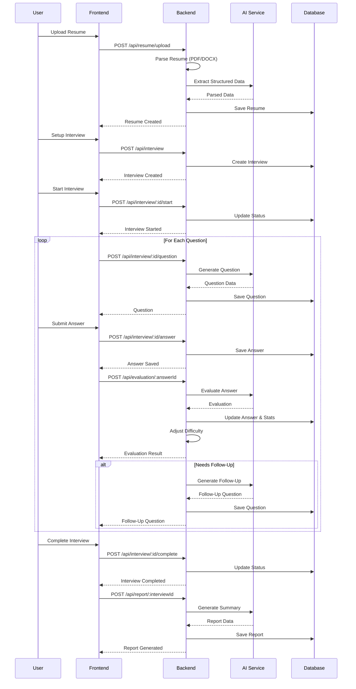
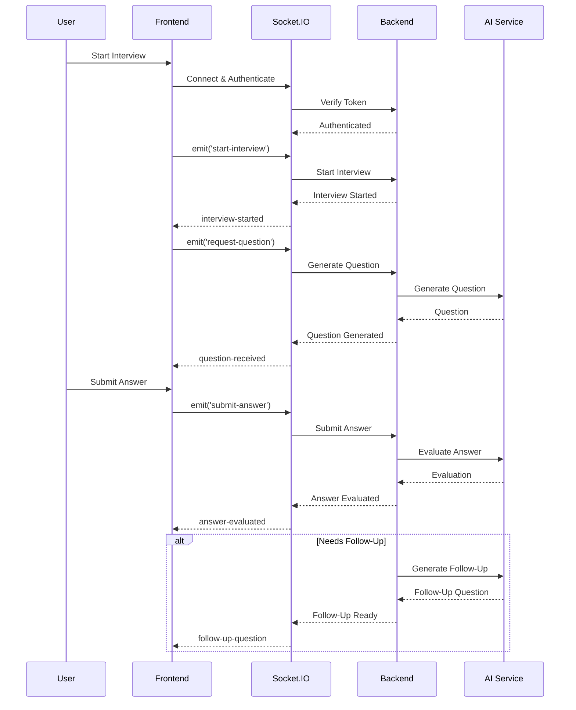

# Interview Flow

## Interview Process Flow

```mermaid
sequenceDiagram
    participant User
    participant Frontend
    participant Backend
    participant AI Service
    participant Database
    
    User->>Frontend: Upload Resume
    Frontend->>Backend: POST /api/resume/upload
    Backend->>Backend: Parse Resume (PDF/DOCX)
    Backend->>AI Service: Extract Structured Data
    AI Service-->>Backend: Parsed Data
    Backend->>Database: Save Resume
    Backend-->>Frontend: Resume Created
    
    User->>Frontend: Setup Interview
    Frontend->>Backend: POST /api/interview
    Backend->>Database: Create Interview
    Backend-->>Frontend: Interview Created
    
    User->>Frontend: Start Interview
    Frontend->>Backend: POST /api/interview/:id/start
    Backend->>Database: Update Status
    Backend-->>Frontend: Interview Started
    
    loop For Each Question
        Frontend->>Backend: POST /api/interview/:id/question
        Backend->>AI Service: Generate Question
        AI Service-->>Backend: Question Data
        Backend->>Database: Save Question
        Backend-->>Frontend: Question
        
        User->>Frontend: Submit Answer
        Frontend->>Backend: POST /api/interview/:id/answer
        Backend->>Database: Save Answer
        Backend-->>Frontend: Answer Saved
        
        Frontend->>Backend: POST /api/evaluation/:answerId
        Backend->>AI Service: Evaluate Answer
        AI Service-->>Backend: Evaluation
        Backend->>Database: Update Answer & Stats
        Backend->>Backend: Adjust Difficulty
        Backend-->>Frontend: Evaluation Result
        
        alt Needs Follow-Up
            Backend->>AI Service: Generate Follow-Up
            AI Service-->>Backend: Follow-Up Question
            Backend->>Database: Save Question
            Backend-->>Frontend: Follow-Up Question
        end
    end
    
    User->>Frontend: Complete Interview
    Frontend->>Backend: POST /api/interview/:id/complete
    Backend->>Database: Update Status
    Backend-->>Frontend: Interview Completed
    
    Frontend->>Backend: POST /api/report/:interviewId
    Backend->>AI Service: Generate Summary
    AI Service-->>Backend: Report Data
    Backend->>Database: Save Report
    Backend-->>Frontend: Report Generated
```

## Real-Time Interview Flow (WebSocket)

```mermaid
sequenceDiagram
    participant User
    participant Frontend
    participant Socket.IO
    participant Backend
    participant AI Service
    
    User->>Frontend: Start Interview
    Frontend->>Socket.IO: Connect & Authenticate
    Socket.IO->>Backend: Verify Token
    Backend-->>Socket.IO: Authenticated
    
    Frontend->>Socket.IO: emit('start-interview')
    Socket.IO->>Backend: Start Interview
    Backend-->>Socket.IO: Interview Started
    Socket.IO-->>Frontend: interview-started
    
    Frontend->>Socket.IO: emit('request-question')
    Socket.IO->>Backend: Generate Question
    Backend->>AI Service: Generate Question
    AI Service-->>Backend: Question
    Backend-->>Socket.IO: Question Generated
    Socket.IO-->>Frontend: question-received
    
    User->>Frontend: Submit Answer
    Frontend->>Socket.IO: emit('submit-answer')
    Socket.IO->>Backend: Submit Answer
    Backend->>AI Service: Evaluate Answer
    AI Service-->>Backend: Evaluation
    Backend-->>Socket.IO: Answer Evaluated
    Socket.IO-->>Frontend: answer-evaluated
    
    alt Needs Follow-Up
        Backend->>AI Service: Generate Follow-Up
        AI Service-->>Backend: Follow-Up Question
        Backend-->>Socket.IO: Follow-Up Ready
        Socket.IO-->>Frontend: follow-up-question
    end
```
